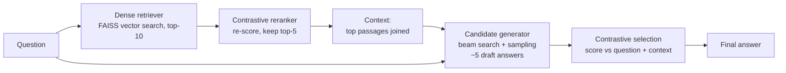
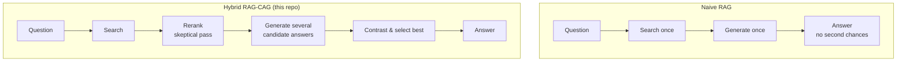
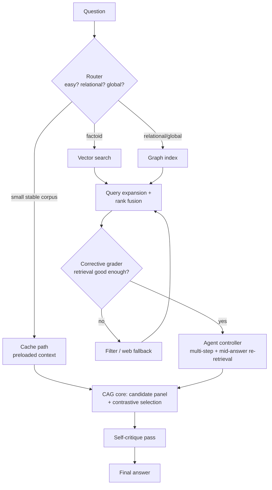

# Extended Introduction: RAG and Hybrid RAG-CAG, Explained From Zero

This guide assumes **no background in machine learning or NLP**. If you can
use a search engine, you can understand this system. (A denser, technical
version is in [INTRODUCTION.md](INTRODUCTION.md).)

## The problem in plain terms

A chatbot like the large language models (LLMs) behind modern AI assistants
has read enormous amounts of text and, in a loose sense, "remembers" it. But
it has two embarrassing habits:

1. **It makes things up.** When it doesn't know an answer, it often invents a
   plausible-sounding one with full confidence. This is called
   *hallucination*.
2. **Its memory is frozen.** It knows nothing about anything that happened
   after its training data was collected, and it never learned your private
   documents at all.

The standard fix is called **Retrieval-Augmented Generation (RAG)** [1], and
the best everyday analogy is an **open-book exam**. Instead of forcing the
student (the LLM) to answer from memory, you hand them a library card. For
each question, a **librarian** (the *retriever*) runs to the shelves, fetches
the most relevant pages, and lays them on the desk. The student then writes
the answer *while looking at those pages*.

This helps a lot — but only if the librarian brings the right books, and only
if the student actually reads them carefully. Naive RAG fails on both counts
surprisingly often.

## How the librarian actually finds pages

Computers can't search by meaning directly; they search by numbers. Every
document is converted into a long list of numbers (an *embedding*) such that
texts with similar meanings get similar numbers. The question gets the same
treatment, and the librarian returns the documents whose numbers are closest
to the question's numbers. This approach, called **Dense Passage Retrieval
(DPR)** [2], beats old-fashioned keyword search by a wide margin.

> **The math, in one sentence (cosine similarity):** treat each embedding as
> an arrow from the origin, and measure the angle between the question's
> arrow and each document's arrow — smaller angle means more similar meaning.
> Friendly explainer: [StatQuest on cosine similarity](https://statquest.org/)
> and [3Blue1Brown's linear algebra series](https://www.3blue1brown.com/topics/linear-algebra)
> for the vector intuition.

Fast similarity search over millions of vectors is done with a library called
FAISS — think of it as an extremely well-organized card catalog.

## What this repository adds: don't trust the first draft

Here is the key insight of the **Hybrid RAG-CAG** system in
`src/hybrid_rag_cag_system.py`. A naive system does: *search once → read once
→ answer once*. Each "once" is a chance to go wrong. This system adds two
extra layers of skepticism:

**1. A second librarian's opinion (reranking).** The first search returns ten
candidate passages; a second, more careful pass re-scores them and keeps only
the best few. Cheap, and it filters out a lot of noise before the student
ever sees it.

**2. A panel of candidate answers (the CAG layer).** Instead of writing one
answer, the student drafts *several* different answers (some careful and
systematic, some more varied). Then a judge scores every draft on two
questions: *Does it actually answer the question?* and *Is it supported by
the pages on the desk?* The draft with the best combined score wins. This
"generate a panel, then contrast and select" idea is closely related to
published work like SuRe [5] (candidate answers checked against summaries of
the evidence) and Adaptive Contrastive Decoding [6] (contrasting outputs to
cope with noisy retrieved context).

> **The math, in one sentence (contrastive score / softmax):** each candidate
> gets a score; scores are turned into probabilities that sum to 1 by
> exponentiating and normalizing, and training pushes the best candidate's
> probability up while pushing the others down. Friendly explainer:
> [StatQuest on softmax](https://statquest.org/).

The training procedure rewards exactly this behavior: the system is
simultaneously taught to (a) write answers that match correct ones, (b) rank
the best candidate above the rest, and (c) keep the candidates diverse, so
the panel doesn't collapse into five copies of the same guess.

## The whole pipeline at a glance

## Naive RAG vs. this hybrid

## Does it work? Honest numbers

The system was tested on three tiers of increasing difficulty (details in
[TECHNICAL_EVALUATION_NOTES.md](TECHNICAL_EVALUATION_NOTES.md)):

- **Tier 1 (12 basic questions):** F1 **0.389** — a **57.5% improvement**
  over the same system with the extra layers switched off (plain RAG, 0.247).
  The layered design clearly helps.
- **Tier 2 (55 questions, compared with 5 other published-style systems):**
  F1 **0.276** — competitive, but *not* the best; a stronger "Advanced RAG"
  baseline scored 0.369.
- **Tier 3 (26 PhD-level science questions):** F1 **0.140**, which is only
  **38.1% of the expert reference** (0.368). On hard physics questions the
  system essentially failed.

> **The math, in one sentence (F1):** F1 is the harmonic mean of precision
> (of the words in the answer, how many are right?) and recall (of the right
> words, how many were found?), so it punishes answers that are either sloppy
> or incomplete. Friendly explainer: [Khan Academy's precision/recall material](https://www.khanacademy.org/)
> and StatQuest's F1 video.

**Caveats that matter:** the datasets are small; the Tier-3 "expert" answers
are simulated inside the evaluation code, not collected from real humans; and
the statistics are exploratory. This is a research prototype, not a product.
The honest takeaway: the hybrid design beats its own simpler self, matches
roughly the middle of the current field, and is nowhere near expert-level
scientific reasoning.

## Where the field is going — and this repo's roadmap

RAG has evolved from "naive" pipelines into *modular* systems [15] where each
stage can be swapped and upgraded. The planned upgrades (full details in
[ROADMAP.md](ROADMAP.md)) each borrow a published idea:

- **RAG-Fusion** [14]: ask the librarian the same question phrased several
  different ways, then merge the result lists.
  > **The math, in one sentence (reciprocal rank fusion):** a document's
  > merged score is the sum of 1/(rank + constant) across all the lists it
  > appears in, so documents near the top of several lists win.
- **CRAG** [8]: a grader that judges whether the fetched pages are any good,
  and triggers a fallback (like a web search) when they're not.
- **GraphRAG / LightRAG** [12, 13]: besides the page-by-page catalog, build a
  *map of who-is-related-to-what* (a knowledge graph), which answers big
  "how does X connect to Y" questions that page search misses.
- **Agentic RAG / ReAct / FLARE** [9, 10, 11, 16]: let the system *plan*
  multi-step searches and fetch more pages mid-answer when it notices it's
  uncertain — like a student allowed to return to the library mid-exam.
- **Cache-augmented generation + Self-Route** [4, 17]: if the whole bookshelf
  is small, just put it on the desk (preload into the model's working
  memory), and route each question to the cheapest method that can handle it.
- **Self-RAG** [7]: teach the system to critique its own draft before
  showing it to you.

The **one rule of the roadmap**: the CAG "panel of candidates + contrastive
selection" core never changes; every new idea plugs in *around* it.

## Where to go next

- Technical version: [INTRODUCTION.md](INTRODUCTION.md)
- What is built vs. planned: [METHODS.md](METHODS.md)
- Improvement plan: [ROADMAP.md](ROADMAP.md)
- Evaluation caveats: [TECHNICAL_EVALUATION_NOTES.md](TECHNICAL_EVALUATION_NOTES.md)

## References

1. Lewis et al. 2020, "Retrieval-Augmented Generation for Knowledge-Intensive NLP Tasks", NeurIPS 2020. arXiv:2005.11401
2. Karpukhin et al. 2020, "Dense Passage Retrieval for Open-Domain Question Answering" (DPR), EMNLP 2020. arXiv:2004.04906
3. Izacard & Grave 2021, "Leveraging Passage Retrieval with Generative Models for Open Domain QA" (FiD), EACL 2021. arXiv:2007.01282
4. Chan et al. 2024, "Don't Do RAG: When Cache-Augmented Generation is All You Need for Knowledge Tasks". arXiv:2412.15605
5. Kim et al. 2024, "SuRe: Summarizing Retrievals using Answer Candidates for Open-domain QA of LLMs", ICLR 2024. arXiv:2404.13081
6. Kim et al. 2024, "Adaptive Contrastive Decoding in Retrieval-Augmented Generation for Handling Noisy Contexts" (ACD). arXiv:2408.01084
7. Asai et al. 2023, "Self-RAG: Learning to Retrieve, Generate, and Critique through Self-Reflection", ICLR 2024. arXiv:2310.11511
8. Yan et al. 2024, "Corrective Retrieval Augmented Generation" (CRAG). arXiv:2401.15884
9. Yao et al. 2022, "ReAct: Synergizing Reasoning and Acting in Language Models", ICLR 2023. arXiv:2210.03629
10. Schick et al. 2023, "Toolformer: Language Models Can Teach Themselves to Use Tools", NeurIPS 2023. arXiv:2302.04761
11. Singh/Ehtesham et al. 2025, "Agentic Retrieval-Augmented Generation: A Survey on Agentic RAG". arXiv:2501.09136
12. Edge et al. 2024, "From Local to Global: A Graph RAG Approach to Query-Focused Summarization" (GraphRAG). arXiv:2404.16130
13. Guo et al. 2024, "LightRAG: Simple and Fast Retrieval-Augmented Generation", Findings of EMNLP 2025. arXiv:2410.05779
14. Rackauckas 2024, "RAG-Fusion: a New Take on Retrieval-Augmented Generation", IJNLC 13(1). arXiv:2402.03367
15. Gao et al. 2023, "Retrieval-Augmented Generation for Large Language Models: A Survey". arXiv:2312.10997
16. Jiang et al. 2023, "Active Retrieval Augmented Generation" (FLARE), EMNLP 2023. arXiv:2305.06983
17. Li, Xu et al. 2024, "Retrieval Augmented Generation or Long-Context LLMs? A Comprehensive Study and Hybrid Approach" (Self-Route). arXiv:2407.16833
