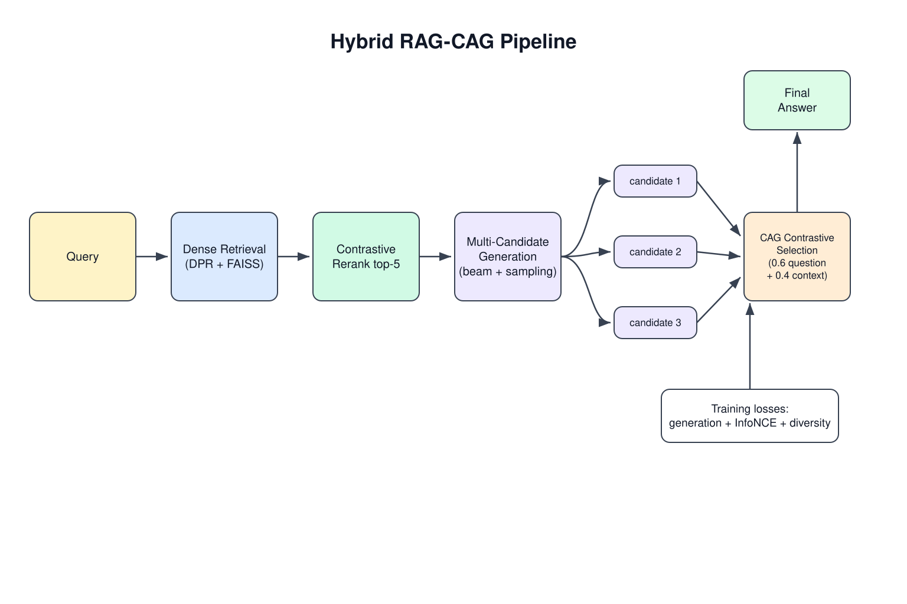

# Introduction: Why Hybrid RAG-CAG?

This document explains, from the ground up, the problem this repository
addresses and how the Hybrid RAG-CAG system in `src/hybrid_rag_cag_system.py`
approaches it. It assumes a technical reader who is new to the project but not
new to machine learning. A zero-background version lives in
[EXTENDED_INTRODUCTION.md](EXTENDED_INTRODUCTION.md).

*Figure 1: The Hybrid RAG-CAG pipeline at a glance — retrieved evidence is reranked, a panel of candidate answers is generated, and the CAG layer selects the best by contrasting question-fit and context-fit. (Text fallback: [figures/concept_figure.md](figures/concept_figure.md).)*

## The problem: LLMs hallucinate and go stale

Large language models store knowledge in their parameters. That has two
well-known failure modes:

1. **Hallucination.** When a model does not know a fact, it often produces a
   fluent, confident, wrong answer anyway.
2. **Knowledge cutoffs.** Parametric knowledge freezes at training time;
   anything newer, rarer, or proprietary is unavailable.

Retrieval-Augmented Generation (RAG), introduced by Lewis et al. [1], is the
standard fix: keep a corpus outside the model, retrieve passages relevant to
the question at inference time, and condition the generator on them. The
corpus can be updated without retraining, and the answer can in principle be
grounded in a specific source passage.

## Naive RAG and its weak points

The original RAG formulation [1] combines a non-parametric dense index with a
parametric seq2seq generator. In its naive form it has three weak points:

- **Retrieval quality bounds everything.** If the retriever misses the
  relevant passage, the generator has nothing correct to work with.
- **Top-1/top-k is a blunt instrument.** The first retrieval pass is taken
  largely on faith; irrelevant passages pollute the context.
- **The generator gets one shot.** Whatever the context supports — or fails
  to support — is baked into a single sampled answer.

This repository can be read as a set of targeted responses to those three
weak points.

## Dense retrieval (DPR)

Karpukhin et al. [2] showed that a dual-encoder (bi-encoder) trained with
contrastive objectives — Dense Passage Retrieval — beats BM25 by 9–19%
absolute in top-20 retrieval accuracy on open-domain QA. The `DenseRetriever`
class in `src/hybrid_rag_cag_system.py` follows this design: a
SentenceTransformer encoder (`all-mpnet-base-v2` by default) embeds the corpus
into a FAISS inner-product index over L2-normalized vectors, so retrieval is
cosine-similarity search. Queries are embedded with the same encoder at
inference time.

Because retrieval is the ceiling for everything downstream, the pipeline adds
a second stage, `ContrastiveReranker`, which re-scores the top-k retrieved
passages by query–document cosine similarity and keeps only the best few.
This is cheap (a few dozen embedding lookups) and removes much of the noise
from the raw top-10.

## Fusion (FiD)

Retrieving good passages is only half the story; the generator must use them.
Izacard & Grave's Fusion-in-Decoder [3] processes multiple retrieved passages
independently in the encoder and fuses them in the decoder, which
substantially improves open-domain QA over single-passage conditioning. Our
system borrows the spirit of FiD: the top reranked passages are concatenated
into the context that conditions candidate generation, so no single passage
is treated as authoritative. The generator here is BART-large
(`facebook/bart-large`), used both for beam-search and nucleus-sampled
candidate generation.

## What the CAG layer adds

The differentiating component of this repo is **Contrastive Answer
Generation/selection (CAG)**: instead of committing to the first generated
answer, the system generates *multiple candidate answers* per question (beam
search plus nucleus sampling) and then selects among them with a contrastive
scoring function. In `HybridGenerator.contrastive_selection`, each candidate
is scored by a weighted combination of its embedding similarity to the
question (0.6) and to the retrieved context (0.4); the argmax wins.

Training is aligned with this behavior through a joint loss
(`HybridRAGCAG.compute_losses`):

- a **generation loss** (token-F1 against gold answers),
- an **InfoNCE contrastive loss** that pushes question embeddings toward the
  best candidate and away from the rest (temperature 0.07),
- a **diversity loss** that penalizes near-duplicate candidates,

combined as `L_total = λ_gen·L_gen + λ_contrastive·L_contrastive + λ_diversity·L_diversity`
with default weights 1.0 / 0.5 / 0.1. The dynamic fusion idea
`H(q) = α(q)·R(q,D) + (1−α(q))·G(q)` expresses the design goal: the final
answer should adaptively blend retrieval-grounded evidence `R(q,D)` and
generative knowledge `G(q)` depending on the question.

This "generate a panel, then contrast and pick" pattern has close neighbors in
the literature: SuRe [5] generates candidate answers, builds
candidate-conditioned summaries of the retrieved passages, and ranks/confirms
the best answer; Adaptive Contrastive Decoding [6] uses contrastive decoding
with an adaptive gate to handle noisy retrieval contexts. The CAG layer in
this repo is a lightweight, trainable cousin of these ideas.

## Results: the three-tier evaluation

The repo evaluates the system in three progressively harder tiers (datasets in
`data/`, scripts in `src/`, full notes in
[TECHNICAL_EVALUATION_NOTES.md](TECHNICAL_EVALUATION_NOTES.md)):

| Tier | Dataset | Hybrid F1 | Reference |
|------|---------|-----------|-----------|
| 1 — Foundational | 12 questions | **0.389** | +57.5% over standalone RAG (0.247) |
| 2 — Enhanced | 55 questions, 6 systems | **0.276** | below Advanced RAG (0.369) |
| 3 — Expert-level | 26 PhD-level scientific questions | **0.140** | 38.1% of expert reference (0.368) |

The honest reading: the hybrid beats its own RAG ablation clearly on the small
foundational set, is *competitive but not dominant* against stronger baselines
(FiD, T5-FiD, DPR+FiD) at Tier 2, and remains far below expert-level
performance on PhD-level science questions — worst on physics (0.098 F1, 0%
success) and mathematics. Performance degrades with question difficulty,
multi-hop reasoning, and domain specialization.

## Limitations (stated plainly)

Following the evaluation notes: the bundled datasets are small and are not
established public benchmarks; the Tier-3 "expert" responses are *simulated*
in the evaluation code and must not be cited as a human study; statistical
outputs are exploratory, without confidence intervals validated on held-out
data; and the system fails often on multi-hop, abstract, and highly
specialized questions. Nothing here establishes suitability for deployment.
These limitations are exactly what the roadmap (see [ROADMAP.md](ROADMAP.md))
is organized to attack.

## Relation to modern RAG paradigms

The field has moved from naive RAG through advanced to *modular* RAG [15].
One sentence each on where this repo sits relative to the major paradigms:

- **Self-RAG** [7] trains reflection tokens so the model decides when to
  retrieve and critiques its own output — a learned version of what our
  roadmap adds as an explicit critique stage.
- **CRAG** [8] adds a retrieval evaluator that triggers corrective actions
  (filtering or web fallback) when retrieval is poor — the "corrective grader"
  we plan for the fused retrieval stage.
- **GraphRAG** [12] builds an entity knowledge graph with hierarchical
  community summaries to answer *global* questions that vector search misses.
- **LightRAG** [13] is a cheaper, incremental dual-level (entity/theme) graph
  retrieval design — our reference implementation choice for a graph index.
- **RAG-Fusion** [14] generates multiple query reformulations and merges
  rankings with reciprocal rank fusion — a drop-in upgrade for our retrieval
  front end.
- **Agentic RAG** [11], via ReAct-style interleaved reasoning and tool use
  [9] and tool-learning [10], wraps retrieval in a multi-step controller, and
  **FLARE** [16] triggers re-retrieval mid-generation when confidence drops.
- **Cache-augmented generation** [4] skips retrieval entirely for small,
  stable corpora by preloading them into the KV cache, and **Self-Route** [17]
  routes easy queries to RAG and hard/global ones to long-context — together
  motivating our planned router plus cache path.

The combination principle (detailed in [METHODS.md](METHODS.md) and
[ROADMAP.md](ROADMAP.md)): **the CAG contrastive answer-selection core stays
immutable; every new paradigm is a pluggable stage around it.**

## References

1. Lewis et al. 2020, "Retrieval-Augmented Generation for Knowledge-Intensive
   NLP Tasks", NeurIPS 2020. arXiv:2005.11401
2. Karpukhin et al. 2020, "Dense Passage Retrieval for Open-Domain Question
   Answering", EMNLP 2020. arXiv:2004.04906
3. Izacard & Grave 2021, "Leveraging Passage Retrieval with Generative Models
   for Open Domain QA" (FiD), EACL 2021. arXiv:2007.01282
4. Chan et al. 2024, "Don't Do RAG: When Cache-Augmented Generation is All
   You Need for Knowledge Tasks". arXiv:2412.15605
5. Kim et al. 2024, "SuRe: Summarizing Retrievals using Answer Candidates for
   Open-domain QA of LLMs", ICLR 2024. arXiv:2404.13081
6. Kim et al. 2024, "Adaptive Contrastive Decoding in Retrieval-Augmented
   Generation for Handling Noisy Contexts". arXiv:2408.01084
7. Asai et al. 2023, "Self-RAG: Learning to Retrieve, Generate, and Critique
   through Self-Reflection", ICLR 2024. arXiv:2310.11511
8. Yan et al. 2024, "Corrective Retrieval Augmented Generation" (CRAG).
   arXiv:2401.15884
9. Yao et al. 2022, "ReAct: Synergizing Reasoning and Acting in Language
   Models", ICLR 2023. arXiv:2210.03629
10. Schick et al. 2023, "Toolformer: Language Models Can Teach Themselves to
    Use Tools", NeurIPS 2023. arXiv:2302.04761
11. Singh/Ehtesham et al. 2025, "Agentic Retrieval-Augmented Generation: A
    Survey on Agentic RAG". arXiv:2501.09136
12. Edge et al. 2024, "From Local to Global: A Graph RAG Approach to
    Query-Focused Summarization" (GraphRAG). arXiv:2404.16130
13. Guo et al. 2024, "LightRAG: Simple and Fast Retrieval-Augmented
    Generation", Findings of EMNLP 2025. arXiv:2410.05779
14. Rackauckas 2024, "RAG-Fusion: a New Take on Retrieval-Augmented
    Generation", IJNLC 13(1). arXiv:2402.03367
15. Gao et al. 2023, "Retrieval-Augmented Generation for Large Language
    Models: A Survey". arXiv:2312.10997
16. Jiang et al. 2023, "Active Retrieval Augmented Generation" (FLARE),
    EMNLP 2023. arXiv:2305.06983
17. Li, Xu et al. 2024, "Retrieval Augmented Generation or Long-Context
    LLMs? A Comprehensive Study and Hybrid Approach" (Self-Route).
    arXiv:2407.16833
