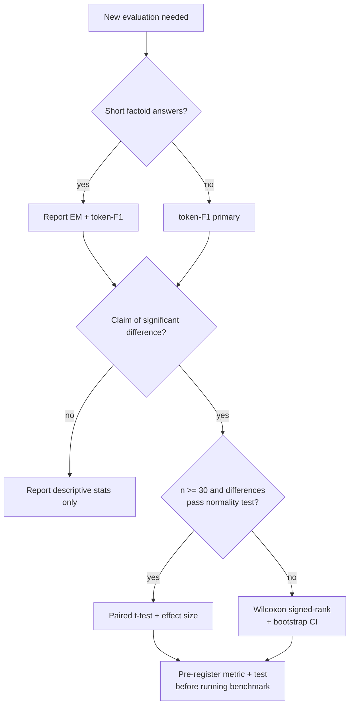

# Methods: Done, Intended, and Undecided

This document records, in the style of a lab methods log, **what is actually
implemented and evaluated** in this repository, **what is planned** (with the
published paradigm each module builds on and the failure mode it targets),
and **which design choices are still open**, with explicit decision rules.

File map for newcomers:

| What | Where |
|------|-------|
| Core system (retriever, reranker, generator, CAG selection, losses) | `src/hybrid_rag_cag_system.py` |
| Tier-1 training/evaluation pipeline | `src/train_and_evaluate.py` |
| Tier-2 full-scale evaluation (55 Qs, 6 systems) | `src/option3_full_scale_evaluation.py` |
| Tier-3 expert-level evaluation | `src/expert_evaluation.py` |
| Evaluation caveats | `docs/TECHNICAL_EVALUATION_NOTES.md` |
| Datasets / results | `data/`, `results/` |

---

## Done

Everything below exists in code and has been run; results are stated as
observed, including where they are unfavorable.

### Dense retrieval bi-encoder

`DenseRetriever` (`src/hybrid_rag_cag_system.py`) embeds the corpus with a
SentenceTransformer (`all-mpnet-base-v2`, 768-dim), L2-normalizes, and builds
a FAISS `IndexFlatIP` index, so retrieval is cosine-similarity search in the
style of DPR [2]. Queries are embedded with the same encoder; top-10 passages
are returned by default.

### Contrastive reranking

`ContrastiveReranker` re-embeds the top-10 retrieved passages and re-scores
them against the question by cosine similarity, keeping top-5. This second
pass removes much of the noise that raw top-k retrieval admits.

### Multi-candidate generation

`HybridGenerator.generate_candidates` uses BART-large to produce multiple
draft answers per question via two decoding strategies: beam search
(diverse, high-precision drafts) and nucleus sampling (temperature 0.7,
top-p 0.9) for additional variety. This is the "candidate panel" the CAG
layer selects from, conceptually adjacent to SuRe's candidate-conditioned
approach [5] and Adaptive Contrastive Decoding [6].

### Contrastive answer selection (the CAG core)

`HybridGenerator.contrastive_selection` scores each candidate by a weighted
cosine-similarity combination — 0.6 × similarity-to-question + 0.4 ×
similarity-to-context — and returns the argmax. This implements the
retrieval-grounded/generative fusion intent expressed as
`H(q) = α(q)·R(q,D) + (1−α(q))·G(q)`: the final answer blends what the
retrieved evidence supports with what the generator knows, weighted by the
question.

### Joint loss

Training (`HybridRAGCAG.compute_losses`) combines:

- **generation loss** — token-F1 distance to gold answers;
- **InfoNCE contrastive loss** — question embedding pulled toward the best
  candidate and pushed from the rest (temperature 0.07);
- **diversity loss** — penalizes near-duplicate candidates;

as `L_total = λ_gen·L_gen + λ_contrastive·L_contrastive + λ_diversity·L_diversity`
with default weights 1.0 / 0.5 / 0.1.

### Three-tier evaluation and observed results

| Tier | Script | Dataset | Hybrid F1 | Reference | Reading |
|------|--------|---------|-----------|-----------|---------|
| 1 | `src/train_and_evaluate.py` | 12 Qs | **0.389** | RAG alone 0.247 | +57.5% over the RAG ablation |
| 2 | `src/option3_full_scale_evaluation.py` | 55 Qs, 6 systems | **0.276** | Advanced RAG 0.369 | competitive, not best |
| 3 | `src/expert_evaluation.py` | 26 PhD-level science Qs | **0.140** | expert ref 0.368 | 38.1% of expert; 0% success on hard physics |

**Honest limitations** (from `docs/TECHNICAL_EVALUATION_NOTES.md`): datasets
are small and not public benchmarks; Tier-3 expert responses are simulated,
not a human study; statistics are exploratory (no validated CIs on held-out
data); multi-hop, abstract, and specialized questions fail often. These
limitations define the roadmap below.

---

## Intended

Planned modules, in build order (details and phases in [ROADMAP.md](ROADMAP.md)).
**Combination principle: the CAG contrastive answer-selection core is
immutable; each paradigm below is a pluggable stage around it**, following the
modular-RAG blueprint [15].

### 1. `src/fusion.py` — RAG-Fusion query expansion [14]

Generate multiple reformulations of the question, retrieve for each, and
merge rankings with reciprocal rank fusion.
*Rationale:* cheap, model-agnostic, immediately improves recall.
*Failure mode it fixes:* a single badly-phrased query misses the relevant
passage (Tier-1/Tier-2 retrieval misses).

### 2. `src/grader.py` — CRAG-style corrective grader [8]

Score the quality of the fused retrieval set; on low confidence, decompose
and filter passages or escalate to a web/fallback search.
*Rationale:* the current pipeline trusts retrieval unconditionally.
*Failure mode it fixes:* garbage context silently producing confident wrong
answers.

### 3. `src/graph_index.py` — LightRAG-style graph index [13] (cf. GraphRAG [12])

Build a dual-level entity/relation graph index alongside the vector store,
with incremental updates.
*Rationale:* relational and global ("how does X connect to Y") questions are
exactly where Tier 3 fails hardest.
*Failure mode it fixes:* vector search cannot compose multi-hop or corpus-wide
structure.

### 4. `src/agent.py` — agent controller with FLARE active retrieval [9, 11, 16]

A ReAct-style controller that plans multi-step retrieval/tool use, with
FLARE-style confidence-triggered re-retrieval mid-generation.
*Rationale:* multi-hop questions need iterative evidence gathering, not one
shot.
*Failure mode it fixes:* 0%-success hard questions that need several
dependent lookups.

### 5. `src/cache_path.py` + router — cache-augmented path [4] + Self-Route [17]

Preload small, stable knowledge slices into the context/KV cache; a
Self-Route-inspired router sends cheap factoid queries to the vector path and
hard/global ones to the cache/long-context or graph path.
*Rationale:* not every question needs the full pipeline; routing cuts cost
and latency.
*Failure mode it fixes:* wasted compute and added retrieval noise on trivial
queries.

### 6. `src/critique.py` — Self-RAG-style critique [7]

A final self-critique pass that checks the selected answer against the
evidence before output (retrieval gating + post-hoc reflection).
*Rationale:* catches residual hallucination after selection.
*Failure mode it fixes:* confident wrong answers that survived the
contrastive panel.

---

## Undecided choices

For each open choice: both options, then the **selection rule** we will apply.

### Embedding model size

- **Option A: keep `all-mpnet-base-v2` (768-dim, ~110M params).** Fast,
  CPU-feasible, reproducible, well documented.
- **Option B: upgrade to a larger/newer embedder.** Likely recall gains at
  the cost of index size and inference latency.

**Selection rule:** switch only if a candidate embedder improves retrieval
recall@10 by ≥ 3 absolute points on the Tier-2 set *and* keeps single-query
latency under 2× the current median on the same hardware.

### Metric: exact match vs. token-F1 vs. LLM-judge

- **Exact match:** cheap, objective, but punishes correct paraphrases —
  too harsh for generative answers.
- **Token-F1 (current):** standard for QA, correlates reasonably with
  correctness, fully reproducible; blind to semantic equivalence with
  different wording.
- **LLM-judge:** captures semantic correctness; but introduces a model
  dependency, cost, non-determinism, and judge bias.

**Selection rule:** token-F1 remains the *primary pre-registered* metric;
exact match is reported alongside; an LLM-judge may be added only as a
secondary, clearly-labeled metric with a fixed judge model, temperature 0,
and a published prompt.

### Significance tests for tier comparisons

- **Parametric (paired t-test):** more power *if* per-question score
  differences are roughly normal; questionable at n = 12–55 with skewed F1
  distributions.
- **Non-parametric (Wilcoxon signed-rank / bootstrap CIs):** no normality
  assumption, robust at small n; slightly less power when normality holds.

**Selection rule:** default to Wilcoxon signed-rank plus a 10,000-sample
bootstrap confidence interval on the mean F1 difference; use a paired t-test
only if a Shapiro–Wilk test on the paired differences fails to reject
normality at α = 0.05 *and* n ≥ 30. Report effect sizes either way.

### Graph index: build-own vs. LightRAG library

- **Build our own:** full control, no external dependency, matches the
  repo's from-scratch ethos; high effort and easy to get wrong.
- **Adopt the LightRAG library [13]:** tested dual-level retrieval,
  incremental updates, cheap; adds a dependency and constrains the design.

**Selection rule:** prototype with the LightRAG library first (fastest path
to evidence); replace with an in-house implementation only if measured
limitations (API fit, license, performance) block a roadmap requirement.

### Metric-selection decision flowchart

---

## References

1. Lewis et al. 2020, "Retrieval-Augmented Generation for Knowledge-Intensive NLP Tasks", NeurIPS 2020. arXiv:2005.11401
2. Karpukhin et al. 2020, "Dense Passage Retrieval for Open-Domain Question Answering" (DPR), EMNLP 2020. arXiv:2004.04906
3. Izacard & Grave 2021, "Leveraging Passage Retrieval with Generative Models for Open Domain QA" (FiD), EACL 2021. arXiv:2007.01282
4. Chan et al. 2024, "Don't Do RAG: When Cache-Augmented Generation is All You Need for Knowledge Tasks". arXiv:2412.15605
5. Kim et al. 2024, "SuRe: Summarizing Retrievals using Answer Candidates for Open-domain QA of LLMs", ICLR 2024. arXiv:2404.13081
6. Kim et al. 2024, "Adaptive Contrastive Decoding in Retrieval-Augmented Generation for Handling Noisy Contexts" (ACD). arXiv:2408.01084
7. Asai et al. 2023, "Self-RAG: Learning to Retrieve, Generate, and Critique through Self-Reflection", ICLR 2024. arXiv:2310.11511
8. Yan et al. 2024, "Corrective Retrieval Augmented Generation" (CRAG). arXiv:2401.15884
9. Yao et al. 2022, "ReAct: Synergizing Reasoning and Acting in Language Models", ICLR 2023. arXiv:2210.03629
10. Schick et al. 2023, "Toolformer: Language Models Can Teach Themselves to Use Tools", NeurIPS 2023. arXiv:2302.04761
11. Singh/Ehtesham et al. 2025, "Agentic Retrieval-Augmented Generation: A Survey on Agentic RAG". arXiv:2501.09136
12. Edge et al. 2024, "From Local to Global: A Graph RAG Approach to Query-Focused Summarization" (GraphRAG). arXiv:2404.16130
13. Guo et al. 2024, "LightRAG: Simple and Fast Retrieval-Augmented Generation", Findings of EMNLP 2025. arXiv:2410.05779
14. Rackauckas 2024, "RAG-Fusion: a New Take on Retrieval-Augmented Generation", IJNLC 13(1). arXiv:2402.03367
15. Gao et al. 2023, "Retrieval-Augmented Generation for Large Language Models: A Survey". arXiv:2312.10997
16. Jiang et al. 2023, "Active Retrieval Augmented Generation" (FLARE), EMNLP 2023. arXiv:2305.06983
17. Li, Xu et al. 2024, "Retrieval Augmented Generation or Long-Context LLMs? A Comprehensive Study and Hybrid Approach" (Self-Route). arXiv:2407.16833
