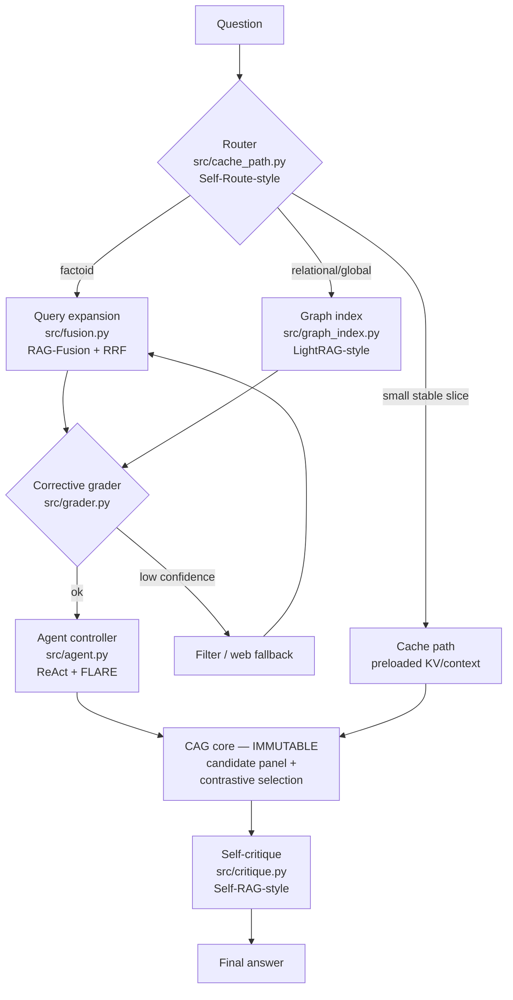

# Roadmap: From Hybrid RAG-CAG to a Modular RAG System

This roadmap upgrades the pipeline in five phases, in the recommended order
(lowest effort / highest immediate gain first). It follows the modular-RAG
blueprint [15]: swappable stages with standardized interfaces around a fixed
core.

> **Combination principle — read this first.**
> The **CAG contrastive answer-selection core is immutable**: candidate
> generation + contrastive selection in `src/hybrid_rag_cag_system.py`
> (conceptually adjacent to SuRe [5] and ACD [6]) does not change its
> interface or behavior. Every paradigm below is a **pluggable stage around
> the core**, each with a feature flag and an ablation switch, so every claim
> of improvement can be tested with the stage on vs. off.

## Target composed architecture

---

## Phase 1 — RAG-Fusion + corrective grader

**New modules:** `src/fusion.py`, `src/grader.py`

- **Goal:** fix retrieval quality at the front of the pipeline, before any
  bigger architectural change.
- **Builds on:** RAG-Fusion [14] (multi-query generation + reciprocal rank
  fusion over dense/sparse lists) and CRAG [8] (a retrieval evaluator that
  triggers corrective actions or fallback when retrieval is poor).
- **Expected gain / failure mode addressed:** retrieval misses caused by a
  single badly-phrased query, and confident wrong answers built on garbage
  context. Low implementation effort; immediate measurable recall@k and F1
  gains on Tier 1–2.
- **Acceptance:** recall@10 improvement on Tier-2 with fusion on vs. off;
  grader flags deliberately corrupted retrieval sets in a unit test.

## Phase 2 — LightRAG graph index

**New module:** `src/graph_index.py`

- **Goal:** answer relational and global questions that vector search
  structurally cannot.
- **Builds on:** LightRAG [13] (dual-level entity/theme graph retrieval,
  incremental updates, low cost), with GraphRAG [12] as the conceptual parent
  (entity KG + hierarchical community summaries).
- **Expected gain / failure mode addressed:** Tier-3-style failures on
  multi-entity and corpus-wide questions; complements, not replaces, the
  vector store.
- **Acceptance:** graph-augmented answers beat vector-only on a curated set
  of relational questions; index updates incrementally without full rebuild.

## Phase 3 — Agent controller + FLARE active retrieval

**New module:** `src/agent.py`

- **Goal:** multi-step reasoning over the retriever, graph index, and other
  tools, with mid-generation re-retrieval.
- **Builds on:** agentic RAG taxonomy [11], ReAct [9] (interleaved reasoning
  and acting), Toolformer [10] (learned tool use), and FLARE [16]
  (confidence-triggered retrieval during generation).
- **Expected gain / failure mode addressed:** the 0%-success hard questions
  that need several dependent lookups; the agent decomposes them into
  sequential evidence-gathering steps.
- **Acceptance:** measurable lift on multi-hop questions; step budget and
  tool-call log recorded for every answer.

## Phase 4 — Cache layer + router

**New modules:** `src/cache_path.py` (router + cache path)

- **Goal:** stop paying full-pipeline cost for every question.
- **Builds on:** cache-augmented generation [4] (preload small stable corpora
  into the KV cache and skip retrieval) and Self-Route [17] (route easy
  queries to cheap RAG, hard/global ones to long-context/graph paths).
- **Expected gain / failure mode addressed:** wasted latency/compute and
  added retrieval noise on trivial factoid queries; the router learns which
  path actually helps per query type.
- **Acceptance:** router decisions logged; end-to-end latency down on the
  factoid subset with no F1 regression beyond a pre-registered tolerance.

## Phase 5 — Self-critique polish

**New module:** `src/critique.py`

- **Goal:** a final Self-RAG-style reflection pass over the CAG-selected
  answer before output.
- **Builds on:** Self-RAG [7] (retrieval gating and self-critique via
  reflection tokens), applied here as a post-selection check rather than a
  retrained model.
- **Expected gain / failure mode addressed:** residual hallucinations that
  survive the contrastive panel; last-line-of-defense quality filter.
- **Acceptance:** critique pass measurably reduces unsupported-answer rate on
  a labeled failure set, with an explicit report of answers it incorrectly
  rejected (false positives are failures too).

---

## Working agreements for every phase

1. **Pre-register** the metric and significance test before running the
   benchmark (see `docs/METHODS.md` → Undecided choices).
2. **Ablate:** every new stage ships with an on/off flag and is reported both
   ways.
3. **Honest negatives:** if a stage does not help, the negative result is
   committed to `results/` and documented, not silently dropped.
4. **Core immutability:** PRs that modify the CAG selection core require
   explicit justification and a full three-tier re-run.

## References

1. Lewis et al. 2020, "Retrieval-Augmented Generation for Knowledge-Intensive NLP Tasks", NeurIPS 2020. arXiv:2005.11401
2. Karpukhin et al. 2020, "Dense Passage Retrieval for Open-Domain Question Answering" (DPR), EMNLP 2020. arXiv:2004.04906
3. Izacard & Grave 2021, "Leveraging Passage Retrieval with Generative Models for Open Domain QA" (FiD), EACL 2021. arXiv:2007.01282
4. Chan et al. 2024, "Don't Do RAG: When Cache-Augmented Generation is All You Need for Knowledge Tasks". arXiv:2412.15605
5. Kim et al. 2024, "SuRe: Summarizing Retrievals using Answer Candidates for Open-domain QA of LLMs", ICLR 2024. arXiv:2404.13081
6. Kim et al. 2024, "Adaptive Contrastive Decoding in Retrieval-Augmented Generation for Handling Noisy Contexts" (ACD). arXiv:2408.01084
7. Asai et al. 2023, "Self-RAG: Learning to Retrieve, Generate, and Critique through Self-Reflection", ICLR 2024. arXiv:2310.11511
8. Yan et al. 2024, "Corrective Retrieval Augmented Generation" (CRAG). arXiv:2401.15884
9. Yao et al. 2022, "ReAct: Synergizing Reasoning and Acting in Language Models", ICLR 2023. arXiv:2210.03629
10. Schick et al. 2023, "Toolformer: Language Models Can Teach Themselves to Use Tools", NeurIPS 2023. arXiv:2302.04761
11. Singh/Ehtesham et al. 2025, "Agentic Retrieval-Augmented Generation: A Survey on Agentic RAG". arXiv:2501.09136
12. Edge et al. 2024, "From Local to Global: A Graph RAG Approach to Query-Focused Summarization" (GraphRAG). arXiv:2404.16130
13. Guo et al. 2024, "LightRAG: Simple and Fast Retrieval-Augmented Generation", Findings of EMNLP 2025. arXiv:2410.05779
14. Rackauckas 2024, "RAG-Fusion: a New Take on Retrieval-Augmented Generation", IJNLC 13(1). arXiv:2402.03367
15. Gao et al. 2023, "Retrieval-Augmented Generation for Large Language Models: A Survey". arXiv:2312.10997
16. Jiang et al. 2023, "Active Retrieval Augmented Generation" (FLARE), EMNLP 2023. arXiv:2305.06983
17. Li, Xu et al. 2024, "Retrieval Augmented Generation or Long-Context LLMs? A Comprehensive Study and Hybrid Approach" (Self-Route). arXiv:2407.16833
